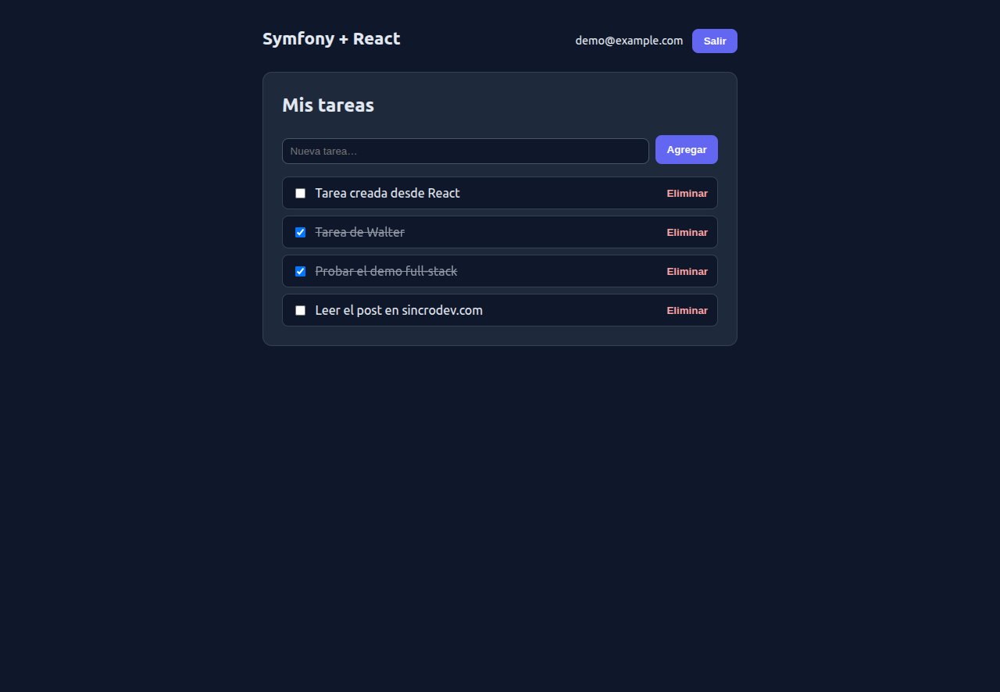

# Symfony + React full-stack (demo)

Base **full-stack autocontenida**: una API REST en **Symfony 7.4** y una SPA
propia en **React + Vite**, con **MySQL 8**, autenticación por **sesión (cookie
HttpOnly)** y un CRUD de tareas privadas por usuario. Todo levanta con un solo
comando (clone & run), sin tener PHP, Composer ni Node instalados en el host.

Es un punto de partida para proyectos donde el backend Symfony y un frontend
React viven en repos/servicios separados y se comunican por HTTP. Está inspirado
en [`Boilerplate-Docker-Symfony`](https://github.com/walteru/Boilerplate-Docker-Symfony),
pero es un demo autocontenido (no un entorno reusable).

> No confundir con [`symfony-api-platform-admin`](https://github.com/walteru/symfony-api-platform-admin):
> ahí el frontend es un **admin generado** por API Platform. Acá el frontend es
> **React escrito a mano** y la API son **controladores Symfony + Serializer**.



## Arquitectura

```
  navegador ──→ http://localhost:8099  (Vite dev server, SPA React)
                      │
                      │  Vite proxyea /api  →  http://api (Symfony)
                      ▼
                 ┌──────────┐        ┌──────────┐
                 │   api    │ ─────→ │    db    │
                 │ Symfony  │  PDO   │ MySQL 8  │
                 │ (Apache) │        └──────────┘
                 └──────────┘
```

El navegador habla **siempre con un solo origen** (`localhost:8099`): Vite
reenvía todo lo que empieza con `/api` al backend. Así la cookie de sesión
(HttpOnly) viaja en cada request **sin depender de CORS**.

| Servicio   | Imagen / build        | Puerto host | Rol                                  |
|------------|-----------------------|-------------|--------------------------------------|
| `frontend` | `node:20-alpine`      | **8099**    | SPA React + Vite (con proxy `/api`)  |
| `api`      | PHP 8.4 + Apache      | **8100**    | API REST Symfony en `/api`           |
| `db`       | `mysql:8.0`           | 3311        | Base de datos                        |

## Arranque (clone & run)

Requisitos: Docker y Docker Compose. Nada más.

```bash
git clone https://github.com/walteru/symfony-react-fullstack.git
cd symfony-react-fullstack
make start          # o: docker compose up -d
```

En el **primer arranque** el backend instala dependencias (`composer install`),
espera a MySQL, aplica migraciones y carga datos demo; el frontend instala sus
`node_modules`. Puede tardar un minuto la primera vez.

- Frontend: <http://localhost:8099>
- API (health): <http://localhost:8100/api/health>

### Usuario demo (credenciales públicas, NO secretas)

```
email:    demo@example.com
password: demo1234
```

También podés crear una cuenta nueva desde el formulario.

## Autenticación y CSRF

- **Sesión con cookie HttpOnly.** El login no devuelve ningún token al
  JavaScript; la sesión vive en una cookie que el navegador no puede leer
  (mitiga XSS). La cookie es `HttpOnly` y `SameSite=Lax`.
- **CSRF en todas las mutaciones.** Como la sesión viaja por cookie, cada
  `POST/PUT/PATCH/DELETE` (incluidos register, login y logout) exige la cabecera
  `X-CSRF-Token`. El token se obtiene en `GET /api/csrf-token` y queda ligado a
  la sesión: un sitio atacante no puede leerlo. El frontend lo gestiona solo.
- **Datos privados por usuario.** El CRUD opera siempre sobre las tareas del
  usuario autenticado. Una tarea ajena o inexistente devuelve **404** (no se
  distingue, para no filtrar la existencia de recursos de otros).

## Endpoints

| Método | Ruta                | Auth | Descripción                          |
|--------|---------------------|------|--------------------------------------|
| GET    | `/api/health`       | no   | Sonda de salud                       |
| GET    | `/api/csrf-token`   | no   | Token CSRF para las mutaciones       |
| POST   | `/api/register`     | no   | Crear cuenta                         |
| POST   | `/api/login`        | no   | Iniciar sesión                       |
| POST   | `/api/logout`       | sí   | Cerrar sesión                        |
| GET    | `/api/me`           | —    | Usuario actual (401 si no hay sesión)|
| GET    | `/api/tasks`        | sí   | Listar mis tareas                    |
| POST   | `/api/tasks`        | sí   | Crear tarea                          |
| PATCH  | `/api/tasks/{id}`   | sí   | Editar tarea propia                  |
| DELETE | `/api/tasks/{id}`   | sí   | Eliminar tarea propia                |

Códigos: `401` sin sesión · `403` falta/ inválido el CSRF · `404` recurso ajeno
o inexistente · `422` payload inválido.

## Comandos útiles (`make`)

```bash
make start        # levanta todo
make test         # corre la suite PHPUnit (sobre MySQL de tests aislado)
make logs         # logs en vivo
make reset-data   # reinicia SOLO los datos de desarrollo (borra el volumen)
make down         # baja contenedores (conserva los datos)
make rebuild      # reconstruye desde cero
```

## Tests

```bash
make test
```

Tests funcionales (`WebTestCase`) que cubren registro, login/logout, validación,
CSRF en mutaciones, contrato JSON y **aislamiento entre usuarios** (un usuario no
puede ver ni tocar tareas de otro). Corren contra una base MySQL de tests
separada (`app_test`).

## Límite deliberado (qué NO es)

Es una **base full-stack con auth y CRUD**, no un SaaS completo. Quedan fuera, a
propósito: recuperación de contraseña, verificación por email, roles, refresh
tokens, build de producción del frontend y despliegue. El **proxy de Vite es de
desarrollo**: en un despliegue real, frontend y API se sirven detrás del mismo
dominio (por ejemplo, con Nginx) para mantener el mismo origen.

## Licencia

MIT — ver [LICENSE](LICENSE).
